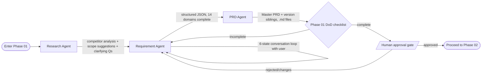

# 02 — Recommended Architecture (Deep Dive)

**Pattern name:** Hierarchical Supervisor Pattern, implemented as a Directed State Graph
**Framework:** LangGraph
**Used at:** the "simple subset" level — `StateGraph` + nodes + conditional edges + a checkpointer. Nothing fancier.

---

## 1. The core idea in one picture

Your own 3-zone / 10-phase model *is already a graph*. We're not inventing a new mental model — we're just giving the one you already designed a runtime.

```mermaid
flowchart TD
    START([Project Created]) --> SUP{Supervisor / Router}

    subgraph ZONE1["ZONE 1 — Planning"]
        P01[Phase 01: Discovery]
        P02[Phase 02: Requirements Deep-Dive]
        P03[Phase 03: Scope & PRD Lock]
    end

    subgraph ZONE2["ZONE 2 — Building"]
        P04[Phase 04..07: Design → Build phases]
    end

    subgraph ZONE3["ZONE 3 — Shipping & Operations"]
        P08[Phase 08..10: Ship, Monitor, Operate]
    end

    SUP --> P01
    P01 --> DOD1{Definition of Done met?}
    DOD1 -- no, needs more info --> P01
    DOD1 -- yes --> HUMAN1[/Human approval gate/]
    HUMAN1 -- approved --> P02
    HUMAN1 -- changes requested --> P01
    P02 --> P03
    P03 --> ZONE2
    ZONE2 --> ZONE3
    ZONE3 --> END([Project Delivered])

    DOD1 -. pivot detected e.g. dependency deprecated .-> CHANGE[Change-Management Sub-flow]
    CHANGE --> P01
```

- **Zones** map to **subgraphs** (a LangGraph graph can contain other graphs as nodes).
- **Phases** map to **nodes** inside a zone's subgraph.
- **Definition of Done checks** map to **conditional edges**.
- **Human approval** maps to a native `interrupt()` — the graph pauses and literally stops executing until your app resumes it with the human's decision.
- **Pivots / change management** (billing module added mid-build, AI model deprecated) map to a **conditional edge that routes back to an earlier phase**, not a special-cased exception — matching what you already decided ("edge cases are explicitly modeled, not treated as exceptions").

---

## 2. Phase 01 (Discovery) in detail — your current focus

This is where Requirement Agent, PRD Agent, and Research Agent live today.



Each box (`Research Agent`, `Requirement Agent`, `PRD Agent`) is one **node function** in the graph. A node function's contract is always the same shape, which is what keeps this simple even as you add Phase 02, 03... later:

```python
def node_fn(state: ProjectState) -> dict:
    """
    Every node:
      1. Reads what it needs from `state`
      2. Does its work (call an LLM, call the Research Agent's search tool, etc.)
      3. Returns a dict of ONLY the state fields it changed
    LangGraph merges the returned dict into the shared state automatically.
    """
    ...
    return {"requirement_json": updated_json, "current_step": "requirement_gathering"}
```

---

## 3. Shared state schema

One typed Pydantic model flows through the whole graph. This is the direct runtime equivalent of the "structured JSON as inter-agent communication format" decision you already made — LangGraph just gives it a persistence layer for free.

```python
# src/agents/shared/state.py
from enum import Enum
from typing import Optional
from pydantic import BaseModel, Field


class Zone(str, Enum):
    PLANNING = "planning"
    BUILDING = "building"
    SHIPPING_OPS = "shipping_and_operations"


class Phase(str, Enum):
    DISCOVERY = "phase_01_discovery"
    REQUIREMENTS_DEEP_DIVE = "phase_02_requirements_deep_dive"
    # ... phase_03 .. phase_10 added as they're designed


class RequirementConversationState(str, Enum):
    """Your existing six-state conversation flow."""
    GREETING = "greeting"
    DOMAIN_SCAN = "domain_scan"
    DEEP_DIVE = "deep_dive"
    CLARIFICATION = "clarification"
    CONFIRMATION = "confirmation"
    DONE = "done"


class ProjectState(BaseModel):
    # Identity
    project_id: str
    current_zone: Zone = Zone.PLANNING
    current_phase: Phase = Phase.DISCOVERY

    # Research Agent output
    research_findings: Optional[dict] = None       # competitor analysis, scope suggestions, clarifying Qs

    # Requirement Agent output
    requirement_conversation_state: RequirementConversationState = RequirementConversationState.GREETING
    requirement_json: Optional[dict] = None         # the 14-domain structured output

    # PRD Agent output
    prd_master_path: Optional[str] = None
    prd_version_paths: list[str] = Field(default_factory=list)

    # Gates
    phase_01_dod_checklist: dict[str, bool] = Field(default_factory=dict)
    pending_human_approval: bool = False
    human_decision: Optional[str] = None            # "approved" | "changes_requested"

    # Change management (pivots)
    pivot_reason: Optional[str] = None              # e.g. "core_model_deprecated", "scope_added_mid_build"

    # Observability
    error_log: list[str] = Field(default_factory=list)
    retry_count: dict[str, int] = Field(default_factory=dict)
```

**Rule of thumb:** state fields are *data*, never behavior. Nodes are the only place behavior lives. This is what keeps the graph easy to reason about as it grows past Phase 01.

---

## 4. Checkpointing — the single most valuable thing this architecture buys you

```python
# src/graph/build.py
from langgraph.graph import StateGraph, START, END
from langgraph.checkpoint.postgres import PostgresSaver   # SqliteSaver for local dev

from src.agents.shared.state import ProjectState
from src.agents.research.node import research_node
from src.agents.requirement.node import requirement_node
from src.agents.prd.node import prd_node
from src.graph.routers import route_after_requirement, route_after_dod_check
from src.graph.gates import phase_01_dod_gate, human_approval_gate

def build_phase_01_graph(checkpointer):
    graph = StateGraph(ProjectState)

    graph.add_node("research", research_node)
    graph.add_node("requirement", requirement_node)
    graph.add_node("prd", prd_node)
    graph.add_node("dod_check", phase_01_dod_gate)
    graph.add_node("human_approval", human_approval_gate)  # uses interrupt()

    graph.add_edge(START, "research")
    graph.add_edge("research", "requirement")
    graph.add_conditional_edges("requirement", route_after_requirement, {
        "continue": "requirement",   # loop until 6-state flow signals DONE
        "next": "prd",
    })
    graph.add_edge("prd", "dod_check")
    graph.add_conditional_edges("dod_check", route_after_dod_check, {
        "incomplete": "requirement",
        "complete": "human_approval",
    })
    graph.add_conditional_edges("human_approval", lambda s: s.human_decision, {
        "approved": END,               # hands off to Phase 02 graph
        "changes_requested": "requirement",
    })

    return graph.compile(checkpointer=checkpointer)
```

What this buys you, for free, without writing it yourself:

- **Resumability** — a `thread_id` (your `project_id`) lets any user close the app mid-conversation and resume exactly where they left off, any time later.
- **Human-in-the-loop** — `human_approval_gate` calls LangGraph's `interrupt()`, which pauses execution and returns control to your API layer. Your backend simply waits for a webhook/API call with the human's decision, then resumes the graph with `Command(resume=decision)`.
- **Time travel / audit trail** — because every node's output is checkpointed, you can replay a project's history for debugging or for showing the user "how the PRD evolved" — directly useful for your multi-version PRD strategy.

---

## 5. How your three existing agent designs plug in

| Your existing design | Runtime role in this architecture |
|---|---|
| **Requirement Agent** (6-state flow, 14 domains, JSON output) | A LangGraph node (or a small internal loop of 2–3 nodes) whose conditional edge checks the 6-state enum and loops on itself until `DONE`, then routes to PRD Agent. |
| **PRD Agent** (JSON → markdown, single/multi-version, DoD) | A node that reads `state.requirement_json`, writes Master PRD + version-sibling `.md` files to disk/storage, and populates `state.prd_master_path` / `state.prd_version_paths`. |
| **Research Agent** (autonomous web search → competitor analysis, scope suggestions, clarifying Qs) | A node that runs *before* Requirement Agent, so its output (`state.research_findings`) can pre-seed Requirement Agent's questions — minimizing questions asked of the human, exactly as designed. |
| **Multi-version PRD strategy** (Master + sibling files) | Lives entirely inside the PRD Agent node's file-writing logic; the graph doesn't need to know about it — it just reads back the resulting paths into state. |
| **Change management (pivot mid-build)** | A conditional edge anywhere in the graph can check for a pivot trigger (e.g. a new tool call detects a deprecated dependency) and route back to an earlier phase's node instead of proceeding — this is a first-class graph feature, not a special case. |

---

## 6. Error handling & retries

- Wrap each node's external calls (LLM call, web search call) in a small retry helper (exponential backoff, max 3 attempts) — see `04-coding-standards-and-rules.md` for the exact rule.
- On exhausted retries, a node writes to `state.error_log` and routes to a dedicated `error_handler` node rather than crashing the whole graph — the project stays resumable even after a transient failure.
- Track `retry_count` per node in state so a node can decide "I've failed 3 times, escalate to human" instead of looping forever.

## 7. Observability

- Structured logging (see file 04) with `project_id` and `current_phase` on every log line, so any project's journey through the graph can be reconstructed from logs alone.
- LangGraph integrates with LangSmith for trace visualization if you want it later — optional, not required for v1.

## 8. Scaling story

- **Start:** one Python process, SQLite checkpointer, single server. Fine for early usage.
- **Grow:** swap `SqliteSaver` → `PostgresSaver` (one line change) and run multiple stateless API workers behind a load balancer — because all state lives in Postgres via the checkpointer, any worker can pick up any project's next step. This is the main reason nodes must stay stateless (no in-memory caches inside a node function).
- **Scale further:** split zones into separately deployed services later (e.g., "Planning zone service", "Building zone service") communicating via a queue, if/when one zone becomes a bottleneck. Not needed at launch — mentioned only so you know the architecture doesn't paint you into a corner.

Full folder layout for all of this → `03-folder-structure.md`.
